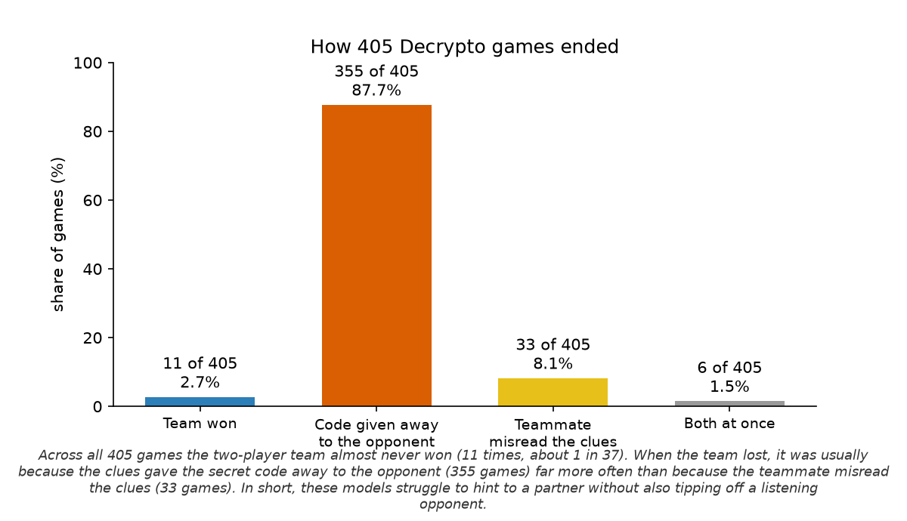
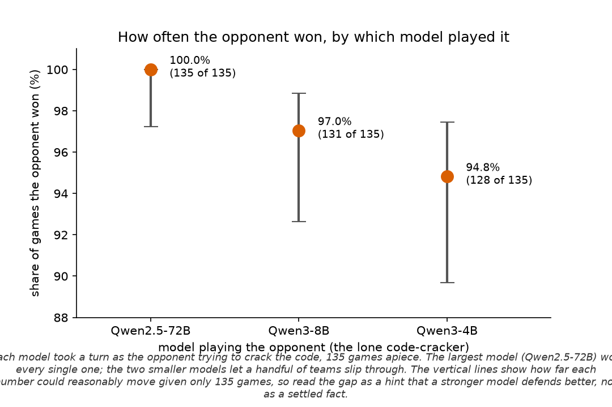
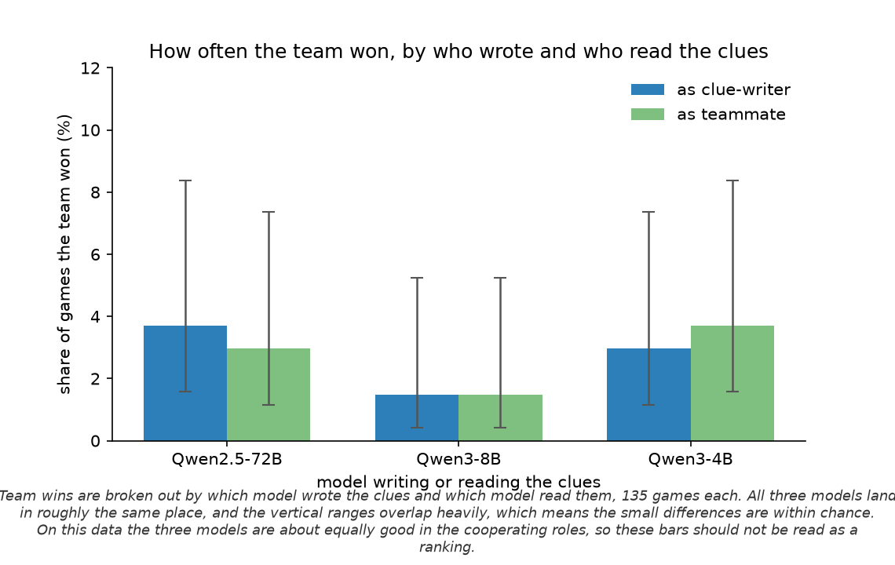
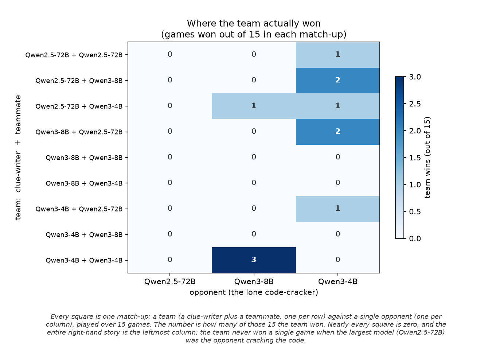

# Polaris 3-model Decrypto cross-play — results

Source data: `results/polaris_3model/experiment_summary.csv` (405 games = 15
`env_seed`s × 27 encoder×decoder×interceptor combinations of Qwen2.5-72B-Instruct,
Qwen3-8B, Qwen3-4B; `num_episodes: 1`, `temperature: 0`). Figures are regenerated
by `analysis/plot_polaris_3model.py` into `results/polaris_3model/figures/`
(both that directory and `*.png` are gitignored — the figures are build
artifacts; the numbers below are the committed record).

> **Why not a 405-row table.** The outcome is overwhelmingly one-sided, so a flat
> dump would bury the result and invite over-reading 1–2-game differences as
> signal. The raw CSV is the reproducibility appendix; communication uses the
> aggregated, uncertainty-aware views below. N is small (15 setups per
> combination), so every rate is reported with a 95% Wilson confidence interval.

## Headline — how 405 games ended



*How the 405 games ended. The two-player team rarely won, and when it lost it was almost always because the clues revealed the secret code to the opponent, rather than because the teammate misread them.*

| Outcome | Games | Share | Interpretation |
|---|---|---|---|
| Team **survived** (team win) | 11 | **2.7%** | balanced clarity vs. secrecy |
| **Intercepted** | 355 | 87.7% | hints too transparent — interceptor cracked the code |
| **Miscommunicated** | 33 | 8.1% | hints too obscure — own decoder failed |
| Both thresholds | 6 | 1.5% | — |

The cooperating team wins **2.7%** of games; the defense wins **97.3%**. Failure
is by transparency over obscurity **10.8 : 1** (355 vs 33) — these models cannot
hide a code from an all-seeing interceptor while still cueing their partner.
Games end fast (mean 4.4 turns; the interceptor reaches two interceptions by
~turn 4).

## The one suggestive model effect — the interceptor



*How often the opponent won, depending on which model played the lone code-cracker. The largest model won every one of its games; the smaller two let a few teams through. The vertical lines show how much each number could move given only 135 games apiece, so the gap is a hint, not a settled fact.*

| Interceptor | Defense-win rate | 95% Wilson CI | Team wins it allowed |
|---|---|---|---|
| Qwen2.5-72B | 135/135 = **100.0%** | [97.2, 100.0] | **0** |
| Qwen3-8B | 131/135 = 97.0% | [92.6, 98.8] | 4 |
| Qwen3-4B | 128/135 = 94.8% | [89.7, 97.5] | 7 |

A monotone gradient — the larger interceptor defends better, and Qwen2.5-72B was
never beaten. This is the only place model identity plausibly matters, and even
here the CIs overlap at N=135; treat it as suggestive, not established.

## The cooperating roles are statistically indistinguishable



*How often the team won, split by which model wrote the clues and which model read them. The three models land in about the same place and their ranges overlap, so the differences are within chance — this is not a ranking.*

| Model | as Encoder (team-survival) | as Decoder (team-survival) |
|---|---|---|
| Qwen2.5-72B | 3.7% [1.6, 8.4] | 3.0% [1.2, 7.4] |
| Qwen3-8B | 1.5% [0.4, 5.2] | 1.5% [0.4, 5.2] |
| Qwen3-4B | 3.0% [1.2, 7.4] | 3.7% [1.6, 8.4] |

Every interval overlaps every other. As encoder or decoder the three models are
not distinguishable on this data — **do not read these as a ranking.**

## Where the few wins came from — every match-up at a glance



*Each square is one match-up: a team (a clue-writer plus a teammate, one per row) against a single opponent (one per column), played over 15 games. The number is how many of those 15 the team won. Almost every square is zero; the wins are scattered against the two smaller opponents, and the entire Qwen2.5-72B column is blank — the team never won a single game when the largest model was the one trying to crack the code.*

This is the full 9-teams × 3-opponents grid behind the 11 team wins. Two things
stand out and neither is visible in any flat table: the wins are sparse and
scattered (no team is reliably good), and the strongest model as the opponent
produced a clean shutout (45 games, zero team wins). The single darkest square —
the all-Qwen3-4B team beating the Qwen3-8B opponent 3 times out of 15 — is the
best any pairing managed, which is itself a statement about how hard the task is.

## Adversarial caveats (read before citing any number)

- **Game-structure effect, not a model leaderboard.** The defense wins even in
  all-72B self-play, so this primarily measures *whether current LLMs can do
  steganographic cooperation* (they almost cannot), not relative model quality.
- **The losses are real, not parsing artifacts.** Exactly **1 format-failure in
  405 games** (vs the Qwen2.5-0.5B smoke, which was all malformed output). The
  97% defense rate is a strategic result, not a pipeline artifact.
- **Limited statistical power.** `temperature=0`, one episode per combination, so
  each (combination, seed) is a single deterministic game; the only randomness is
  the 15 `env_seed`s (keyword/code draws). Read every rate as "fraction of 15
  setups," and do not interpret sub-CI differences.
- **Report the failure direction, not just win/loss.** The intercept-vs-miscomm
  split (10.8 : 1) is the substantive finding; a single win-rate hides it.
- **Self-play vs cross-play.** Mixed-model teams do not survive at a materially
  different rate than same-model teams here — every (encoder, decoder) cell is
  near the floor (0–3 survivals out of 45).

## Reproduce

```bash
BASE=/lus/eagle/projects/lighthouse-uchicago/members/mehta5
$BASE/conda-envs/decrypto-serve/bin/python analysis/plot_polaris_3model.py
# -> results/polaris_3model/figures/fig{1,2,3}_*.png
```
